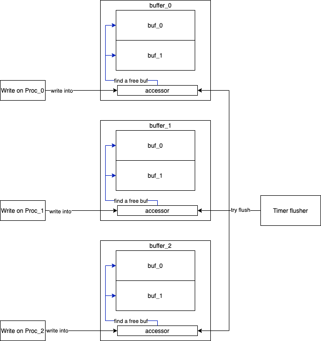

- [x] basic rpc logic
- [x] graceful shutdown
- [ ] humanize api
- [x] client conn pool for a stateless server rpc  
- [x] add auto batch write(may depends on the memory pool)  
- [ ] add context to reduce the possibility  and positioning of coroutine leakage

bench result  
"Stp" means stupid,a milestone of the framework  
the test cases are 64~64k bytes that 5462 bytes on average protobuf message  
SyncStd means use net/rpc with default codec and just for Compared   
the detail of this bench please move to [test/bench](test/bench)  
"1C,16C" means open how many client to test  
benchmark platform :
- CPU: 2.2 GHz Intel Core i7
- Memory: 16 GB 1600 MHz DDR3
- Platform: MacBook Pro 2015
- OS: macOS Mojave 10.14.6
- Go: 1.15


benchmark data :
```
name         time/op
Stp1C-8        5.87µs ±22%
Stp16C-8       8.14µs ±27%
Std1C-8        13.5µs ±62%
Rpcx16C-8      14.4µs ±18%
Std16C-8       17.6µs ±11%
Hprose16C-8    34.1µs ± 5%
Hprose1C-8     57.2µs ±16%
Rpcx1C-8        124µs ±19%

name         speed
Stp1C-8      1.88GB/s ±19%
Stp16C-8     1.40GB/s ±30%
Std1C-8       873MB/s ±43%
Rpcx16C-8     770MB/s ±20%
Std16C-8      625MB/s ±11%
Hprose16C-8   320MB/s ± 5%
Hprose1C-8    192MB/s ±14%
Rpcx1C-8     89.2MB/s ±22%

name         alloc/op
Stp1C-8          124B ±57%
Stp16C-8       3.56kB ±58%
Std1C-8        5.79kB ± 0%
Std16C-8       5.82kB ± 0%
Rpcx1C-8       46.7kB ± 1%
Rpcx16C-8      49.0kB ± 1%
Hprose1C-8     60.3kB ± 0%
Hprose16C-8    61.1kB ± 0%

name         allocs/op
Stp1C-8          0.00
Stp16C-8         0.00
Std1C-8          10.0 ± 0%
Std16C-8         10.0 ± 0%
Rpcx1C-8         27.4 ± 2%
Rpcx16C-8        27.4 ± 2%
Hprose1C-8       34.0 ± 0%
Hprose16C-8      36.0 ± 0%

```


addition:

the f-buffer design:
